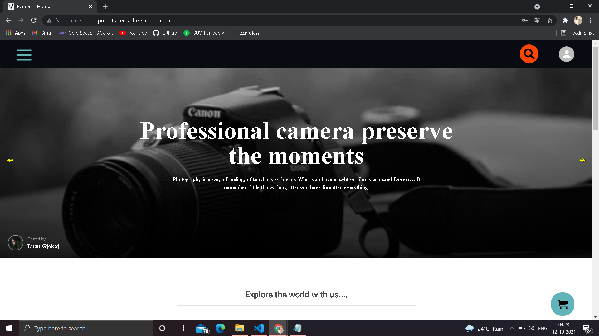
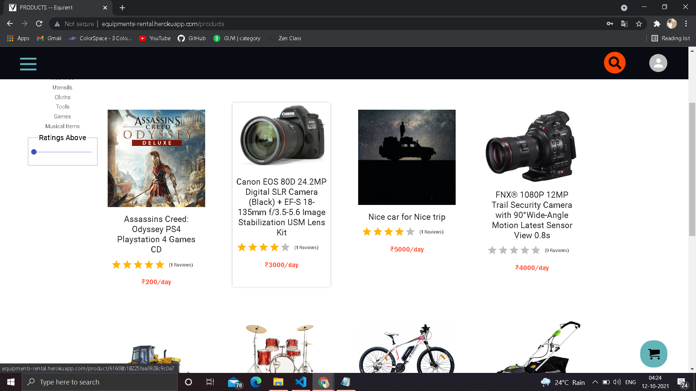
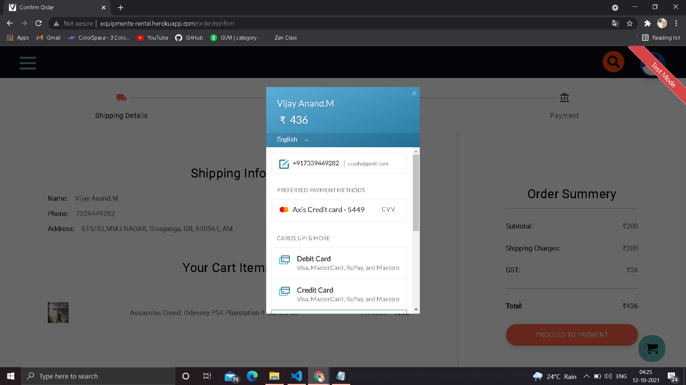
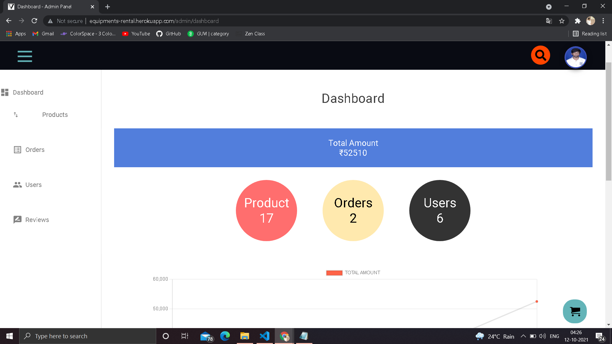
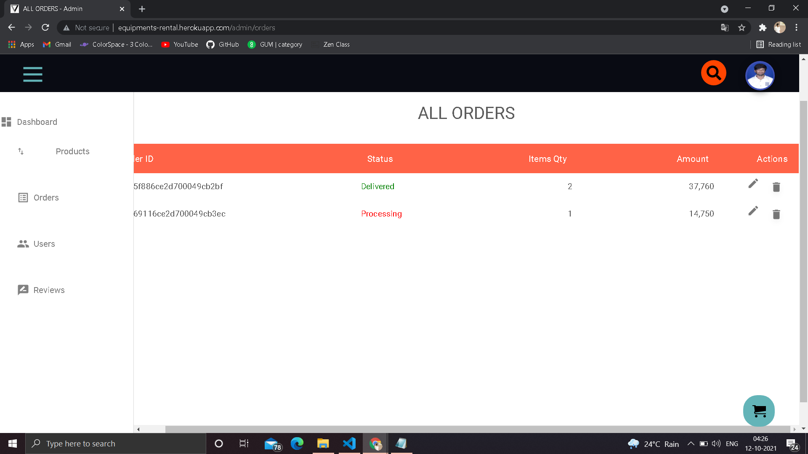

# Equrent (Equipment Rental E-commerce site)

### Bulid on MERN Stack


[](http://equipments-rental.herokuapp.com/)


## <a href="http://equipments-rental.herokuapp.com/" target="_blank">LIVE DEMO</a>


A E-commerce site built to make the way of purchasing rental products easier 

####   Packages used:
- Frontend: React , Redux , Material-UI , Axios , React-Alert , Router-Dom
 
- Backend: Node , Mongoose , Express , Cloudinary , Nodemailer , Razorpay


## Features

- Frontend is designed mainly considering the users experience in which only will have any kind of struggle to find the buttons and functionality of the site
- The payment Process from the Razorpay is integrated in highly secured way so there is no kind of data leak
- As the nodemailer is used in the site there is no need to worry about the forgot password functionality
- The Admin Dashboard will always keep track on the orders,users and the amount 


## If you wish to reuse my code Don't forget to add the following things in your config.env file  

> DB_URI
> PORT
> RAZORPAY_API_KEY
> RAZORPAY_SECRET_KEY
> JWT_SECRET
> JWT_EXPIRE
> COOKIE_EXPIRE
>SMPT_SERVICE
>SMPT_MAIL
>SMPT_PASSWORD
>SMPT_HOST
>SMPT_PORT
>CLOUDINARY_NAME
>CLOUDINARY_API_KEY
>CLOUDINARY_API_SECRET


## Admin Credentials

```sh
mail_Id= admin@gmail.com

password=admin123
```

## Demo









## License

MIT

